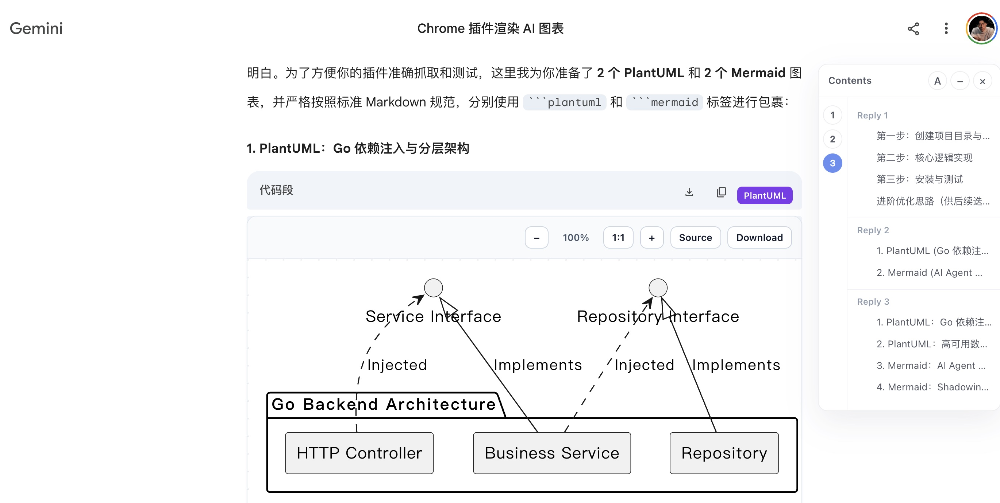

# ChatLayer

<p align="center">
  
</p>
> [!IMPORTANT]
>
> ChatLayer adds a small power-user layer to ChatGPT and Gemini: reply outlines, diagram rendering, and lightweight navigation without replacing the original UI.

<p>
  
</p>

## Features

- Floating table of contents for every AI reply, including replies without headings.
- Clickable `Reply n` navigation that jumps to the start of each AI response.
- Inline Mermaid rendering through a sandboxed extension page.
- PlantUML rendering through a configurable PlantUML server.
- Diagram viewer with zoom, pan, reset, copy source, and open-on-server controls.
- Auto/Light/Dark TOC theme controls.

## Supported Sites

- `https://chatgpt.com/*`
- `https://chat.openai.com/*`
- `https://gemini.google.com/*`

## Install

Download `chatlayer-vX.Y.Z.zip` from the latest [GitHub Release](../../releases/latest), extract it, then load the folder from `chrome://extensions/` with **Developer mode** enabled.

To build from source:

```sh
make install
make build
```

Load the generated `dist/` directory in Chrome.

## Development

```sh
make dev         # Vite development mode
make ci          # typecheck, lint, tests, and production build
make clean       # remove generated output
```

## Privacy

Mermaid runs locally from bundled extension code. PlantUML source is sent to the configured PlantUML server; use a local or self-hosted server for private diagrams.
