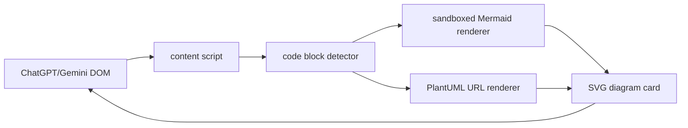

# Chatbot Diagram Renderer Plan

## Scope

Create a new Chrome extension in `/Users/hedon/mycode/ai/show-pic`. The MVP will support:

- ChatGPT: `https://chatgpt.com/*` and `https://chat.openai.com/*`
- Gemini: `https://gemini.google.com/*`
- Mermaid fenced blocks: `mermaid`
- PlantUML fenced blocks: `plantuml`, `puml`, and blocks starting with `@startuml`
- Dynamic rerendering when chatbot responses stream in or regenerate

Before feature development, establish the repository baseline:

- Initialize a Git repository with a clean first commit boundary.
- Add `.gitignore`, `README.md`, `Makefile`, GitHub Actions workflow, and `CLAUDE.md`.
- Define project constraints so future agents and contributors follow the same extension, security, testing, and privacy expectations.

## Architecture

## Implementation Steps

1. Initialize the Git repository and baseline files.
   - Run `git init` in `/Users/hedon/mycode/ai/show-pic`.
   - Add `.gitignore` for Node, Vite, Chrome extension build output, logs, local env files, and OS/editor noise.
   - Add `README.md` with the product goal, supported sites, local development commands, Chrome loading instructions, and privacy note for PlantUML.
   - Do not commit automatically unless explicitly requested after implementation.

2. Add project constraints in `CLAUDE.md`.
   - Capture the core rule: prefer small, typed, testable TypeScript modules.
   - Require Manifest V3-compatible code and avoid remote executable scripts.
   - Require Mermaid rendering to stay sandboxed and PlantUML rendering to make remote-server privacy implications explicit.
   - Require generic DOM detection over brittle ChatGPT/Gemini class names.
   - Require `make ci` before marking work complete when dependencies are available.

3. Add Makefile workflow in `Makefile`.
   - Provide `make install`, `make dev`, `make build`, `make typecheck`, `make lint`, `make test`, `make ci`, and `make clean`.
   - Keep targets thin wrappers around package manager scripts so local and CI behavior match.

4. Add GitHub Actions CI in `.github/workflows/ci.yml`.
   - Trigger on `push` and `pull_request`.
   - Use Node LTS, dependency caching, clean install, typecheck, lint, test, and build.
   - Upload the production extension artifact from `dist/` when build succeeds.

5. Scaffold a Vite + TypeScript Chrome extension.
   - Create `package.json`, `manifest.json`, `vite.config.ts`, and `src/`.
   - Use Manifest V3 with a content script and minimal permissions.

6. Add site-specific DOM scanning in `src/content/index.ts`.
   - Observe chatbot message containers with `MutationObserver`.
   - Find `pre code`, markdown code blocks, and rendered code blocks.
   - Mark processed blocks with a `data-show-pic-rendered` attribute to avoid duplicate rendering.

7. Implement diagram detection in `src/content/detector.ts`.
   - Detect by language class such as `language-mermaid`, `language-plantuml`, `language-puml`.
   - Fall back to source prefixes such as `graph TD`, `sequenceDiagram`, `flowchart`, and `@startuml`.

8. Render Mermaid through a sandbox page.
   - Add `src/sandbox/mermaid.html` and `src/sandbox/mermaid.ts`.
   - Use `mermaid.initialize({ startOnLoad: false, securityLevel: "strict" })` and `mermaid.render(id, source)`.
   - Communicate from the content script to the sandbox iframe with `postMessage` so the extension avoids Manifest V3 CSP issues around Mermaid internals.

9. Render PlantUML through a configurable PlantUML server.
   - Add `src/render/plantuml.ts`.
   - Encode source with UTF-8, raw deflate, then PlantUML's custom base64 alphabet.
   - Use SVG image URLs like `https://www.plantuml.com/plantuml/svg/{encoded}` for the MVP.
   - Store server URL in extension settings so users can switch to a local or self-hosted PlantUML server for private diagrams.

10. Add UI polish and controls in `src/content/diagram-card.ts` and `src/content/styles.css`.
   - Insert the rendered diagram below the original code block.
   - Add actions: collapse/expand source, copy source, open PlantUML server link, retry render.
   - Show inline errors instead of breaking the chatbot page.

11. Add an options page for PlantUML privacy settings.
   - Create `src/options/index.html` and `src/options/index.ts`.
   - Allow users to set `plantumlServerBaseUrl`, defaulting to `https://www.plantuml.com/plantuml`.

12. Validate manually in Chrome.
   - Load `dist/` via `chrome://extensions` developer mode.
   - Test static messages, streaming messages, regenerated messages, dark mode, and multiple diagrams in one answer.
   - Run `make ci` locally if dependencies install successfully.

## Key Risks

- Mermaid in MV3 can hit CSP restrictions if executed directly in content scripts; the sandbox renderer isolates this.
- PlantUML server rendering sends diagram source to the configured server; the options page should make this explicit.
- ChatGPT and Gemini DOM structures change often, so detection should rely on generic code block patterns rather than brittle class names.
- CI can only verify extension build and unit-level behavior; final confidence still requires manual Chrome testing on the target chatbot sites.
